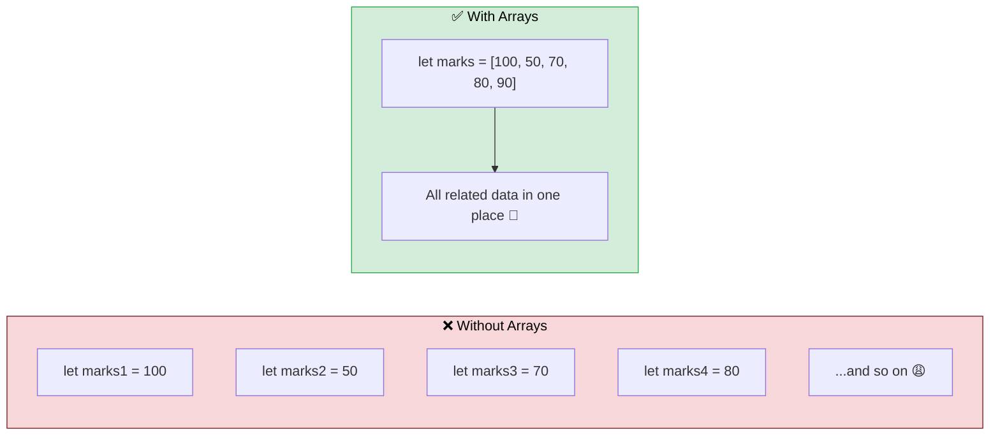
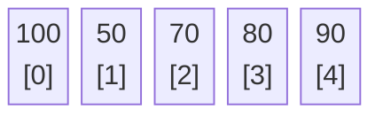
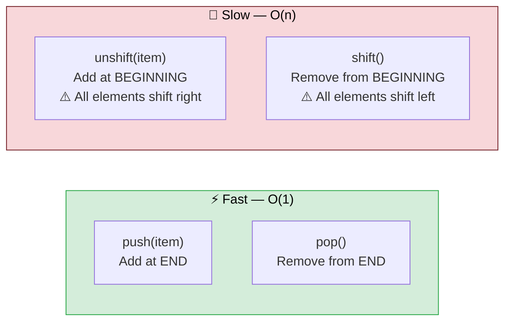
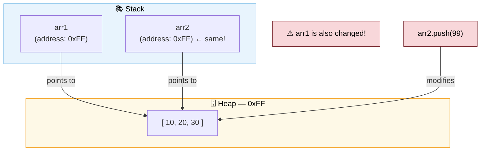
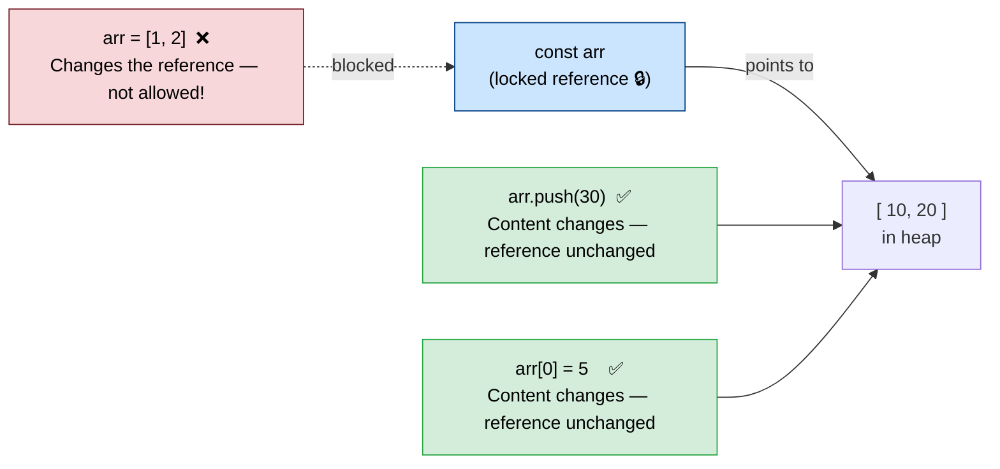
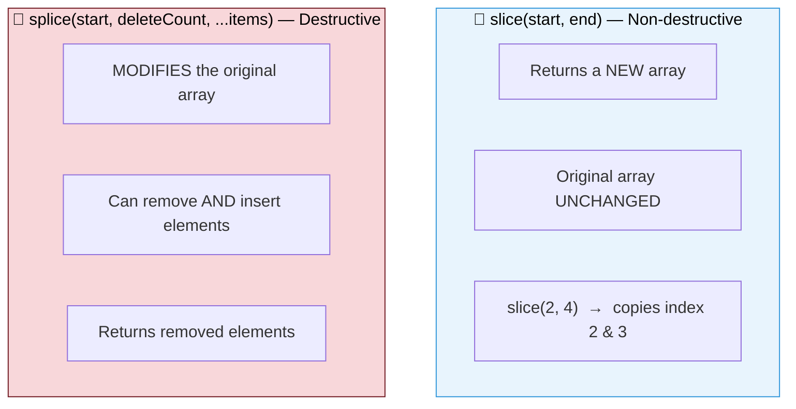
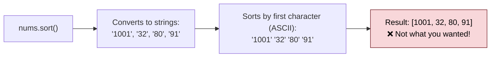
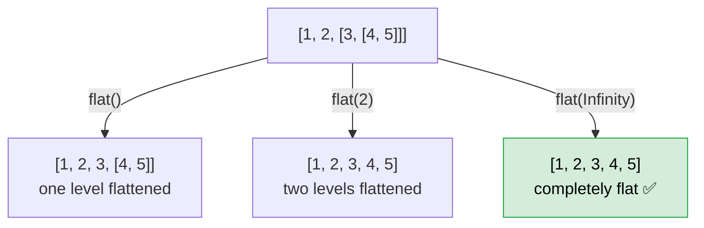
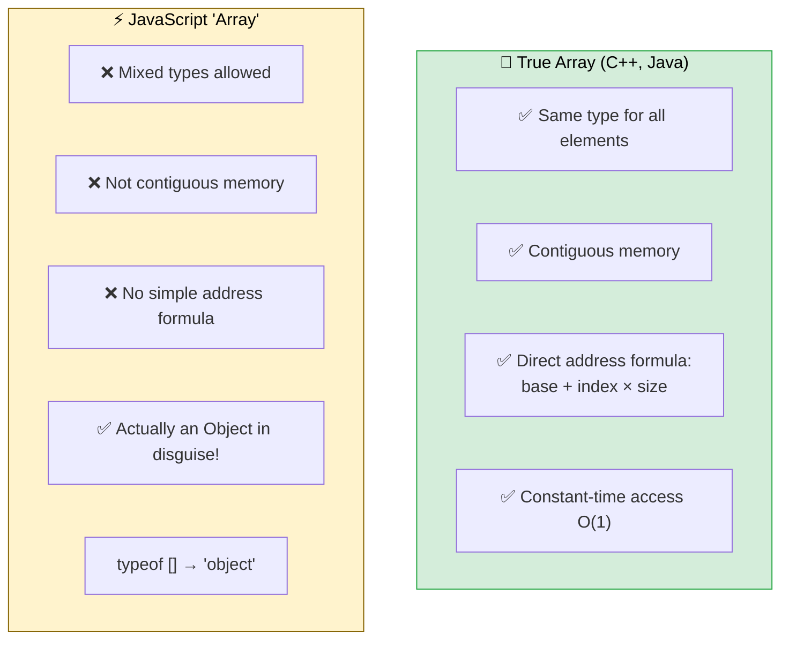
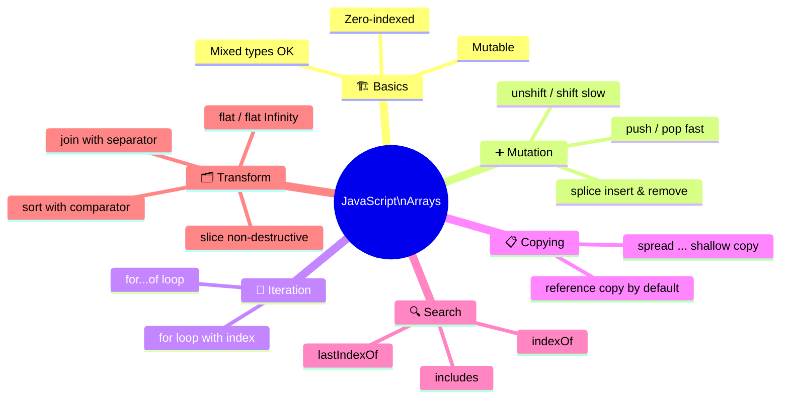

# 📚 JavaScript — Arrays

> *Lecture 6 · Ordered, flexible, mutable — and not quite what you think they are under the hood.*

---

## 📋 Table of Contents

- [What is an Array?](#-what-is-an-array)
- [Creating & Accessing](#-creating--accessing)
- [Mixed Types & Mutability](#-mixed-types--mutability)
- [Adding & Removing Elements](#-adding--removing-elements)
- [Iterating Over Arrays](#-iterating-over-arrays)
- [Copy by Reference](#-copy-by-reference)
- [const with Arrays](#-const-with-arrays)
- [slice vs splice](#-slice-vs-splice)
- [Spread Operator](#-spread-operator)
- [Array → String](#-array--string)
- [Searching](#-searching)
- [Sorting](#️-sorting)
- [Flattening](#-flattening-nested-arrays)
- [Why JS Arrays Aren't True Arrays](#-why-javascript-arrays-arent-true-arrays)

---

## 🤔 What is an Array?

A single variable that holds **multiple values** in order — like a list.



---

## 🏗️ Creating & Accessing

```javascript
let marks = [100, 50, 70, 80, 90];

marks[0];       // 100  ← index starts at 0
marks[1];       // 50
marks[4];       // 90
marks.length;   // 5
```



> 💡 `array[index]` both **reads** and **writes** the element at that position.

---

## 🎨 Mixed Types & Mutability

Unlike C++ or Java, JavaScript arrays can hold **any combination of types**:

```javascript
let mix = [100, 30, "Rohit", true];   // ✅ totally valid
```

And elements can be changed at any time:

```javascript
let arr = [100, 30, "Rohit", true];
arr[1] = 90;   // 30 → 90
console.log(arr);   // [100, 90, "Rohit", true]
```

---

## ➕ Adding & Removing Elements



```javascript
let arr = [10, 20, 30, 50, 60];

arr.push(70);     // [10, 20, 30, 50, 60, 70]  ← fast ⚡
arr.pop();        // removes 70                 ← fast ⚡

arr.unshift(5);   // [5, 10, 20, 30, 50, 60]   ← slow 🐢 (every element moves)
arr.shift();      // removes 5                  ← slow 🐢 (every element moves)
```

**Why `unshift` / `shift` are slow:**

```
Before unshift(70):   [ 10 ][ 20 ][ 30 ][ 50 ][ 60 ]
                         ↓     ↓     ↓     ↓     ↓    ← all shift right
After  unshift(70):   [ 70 ][ 10 ][ 20 ][ 30 ][ 50 ][ 60 ]
```

> 🏎️ **Performance Rule:** Prefer `push` and `pop` whenever possible.

| Method | Position | Speed |
|:------:|:--------:|:-----:|
| `push(item)` | End | ⚡ O(1) |
| `pop()` | End | ⚡ O(1) |
| `unshift(item)` | Beginning | 🐢 O(n) |
| `shift()` | Beginning | 🐢 O(n) |

---

## 🔁 Iterating Over Arrays

```javascript
let arr = [10, 20, 30, 40];

// Classic for loop — when you need the index
for (let i = 0; i < arr.length; i++) {
    console.log(arr[i]);
}

// for...of — cleaner, when you just need the value
for (let item of arr) {
    console.log(item);
}
```

> ✅ Use `for...of` for cleaner, more readable code when you don't need the index.

---

## 🔗 Copy by Reference

Arrays are **reference types** — assigning an array to a new variable copies the *address*, not the data.



```javascript
let arr1 = [10, 20, 30];
let arr2 = arr1;           // copies the ADDRESS, not data

arr2.push(99);

console.log(arr1);   // [10, 20, 30, 99]  😱 also changed!
console.log(arr2);   // [10, 20, 30, 99]
```

> 🛡️ To make an independent copy, use the spread operator: `let arr2 = [...arr1]`

---

## 🔒 `const` with Arrays

`const` locks the **reference** — not the contents.



```javascript
const arr = [10, 20];

arr.push(30);   // ✅ allowed — modifying contents
arr[0] = 5;     // ✅ allowed — modifying contents

arr = [1, 2];   // ❌ Error! — trying to change the reference itself
```

---

## ✂️ `slice` vs `splice`

Two methods that sound the same but behave very differently:



```javascript
let arr = [10, 30, 50, 90, 11];

// slice — safe, returns new array
let sliced = arr.slice(2, 4);
console.log(sliced);   // [50, 90]
console.log(arr);      // [10, 30, 50, 90, 11]  ← unchanged ✅

// splice — modifies original
arr.splice(1, 3, "Rohit", 19);
// From index 1, remove 3 items, insert "Rohit" and 19
console.log(arr);      // [10, "Rohit", 19, 11]  ← changed ⚠️
```

| | `slice` | `splice` |
|--|:-------:|:--------:|
| Modifies original | ❌ No | ✅ Yes |
| Returns | New array | Removed elements |
| Can insert? | ❌ | ✅ |
| Safe to use? | ✅ Always | ⚠️ Be careful |

---

## 🌊 Spread Operator

The `...` operator **expands** an array into individual elements.

```javascript
let a1 = [10, 30];
let a2 = ["Rohit", 11, true];

// ❌ Without spread — nested arrays
let bad = [a1, a2];
// [[10, 30], ["Rohit", 11, true]]

// ✅ With spread — flat merged array
let combined = [...a1, ...a2];
// [10, 30, "Rohit", 11, true]

// ✅ Also use spread for independent copies
let copy = [...a1];   // no shared reference
```

---

## 🔤 Array → String

```javascript
let names = ["Alice", "Bob", "Charlie"];

names.toString();    // "Alice,Bob,Charlie"   ← comma by default
names.join(" ");     // "Alice Bob Charlie"   ← space separator
names.join(" - ");   // "Alice - Bob - Charlie"
names.join("");      // "AliceBobCharlie"     ← no separator
```

> 💡 `join()` is more flexible than `toString()` — always prefer `join` when you need a custom separator.

---

## 🔍 Searching

```javascript
let arr = [10, 20, 30, 20, 40];

arr.indexOf(20);      // 1   — first occurrence
arr.lastIndexOf(20);  // 3   — last occurrence
arr.indexOf(99);      // -1  — not found

arr.includes(30);     // true
arr.includes(99);     // false
```

| Method | Returns | Use Case |
|--------|:-------:|----------|
| `indexOf(item)` | Index or `-1` | Find first position |
| `lastIndexOf(item)` | Index or `-1` | Find last position |
| `includes(item)` | `true`/`false` | Just check existence |

---

## 🗂️ Sorting

### ⚠️ Default `sort()` — Converts to Strings First!

```javascript
let nums = [1001, 32, 80, 91];
nums.sort();
// [1001, 32, 80, 91]  ← NOT numeric sort! 😱
```

Why? `"1001"` < `"32"` because `"1"` < `"3"` in ASCII.



### ✅ Custom Numeric Sort

```javascript
// Ascending ↑
nums.sort((a, b) => a - b);    // [32, 80, 91, 1001]
// if result < 0 → a comes first

// Descending ↓
nums.sort((a, b) => b - a);    // [1001, 91, 80, 32]
```

### String Sorting & ASCII

```
Uppercase: A=65  B=66  ...  Z=90
Lowercase: a=97  b=98  ...  z=122
```

```javascript
["banana", "Apple", "cherry"].sort();
// ["Apple", "banana", "cherry"]
// "Apple" first because 'A'(65) < 'b'(98)
```

---

## 🪗 Flattening Nested Arrays

```javascript
let nested = [1, 2, [3, [4, 5]]];

nested.flat();            // [1, 2, 3, [4, 5]]    ← 1 level
nested.flat(2);           // [1, 2, 3, 4, 5]       ← 2 levels
nested.flat(Infinity);    // [1, 2, 3, 4, 5]       ← all levels ✅
```



---

## 🔬 Why JavaScript Arrays Aren't "True" Arrays

This is one of the most mind-bending facts about JavaScript. 🤯



**Internally, a JS array is just an object with numeric string keys:**

```
JS Array [10, 20, 30]  ≡  Object { "0": 10, "1": 20, "2": 30, length: 3 }
```

```javascript
typeof [];          // "object"  ← not "array"!

let arr = [10, 20];
arr.name = "hello"; // ✅ you can add named properties like an object
```

> 💡 This is why updating an element doesn't shift memory — it's just an **object property update**. The old value is left for garbage collection. This makes JS arrays flexible, but they are not true arrays in the low-level sense.

---

## 📊 Quick Reference



| Task | Method | Modifies Original? |
|------|--------|--------------------|
| Add to end | `push(item)` | ✅ |
| Remove from end | `pop()` | ✅ |
| Add to start | `unshift(item)` | ✅ |
| Remove from start | `shift()` | ✅ |
| Extract portion | `slice(s, e)` | ❌ |
| Remove/insert | `splice(s, n, ...items)` | ✅ |
| Sort | `sort((a,b) => a-b)` | ✅ |
| Flatten | `flat(Infinity)` | ❌ |
| To string | `join(separator)` | ❌ |
| Merge arrays | `[...a, ...b]` | ❌ |

---

<div align="center">

**Happy Coding! 🚀**

*Made with ❤️ for JavaScript beginners everywhere*

</div>