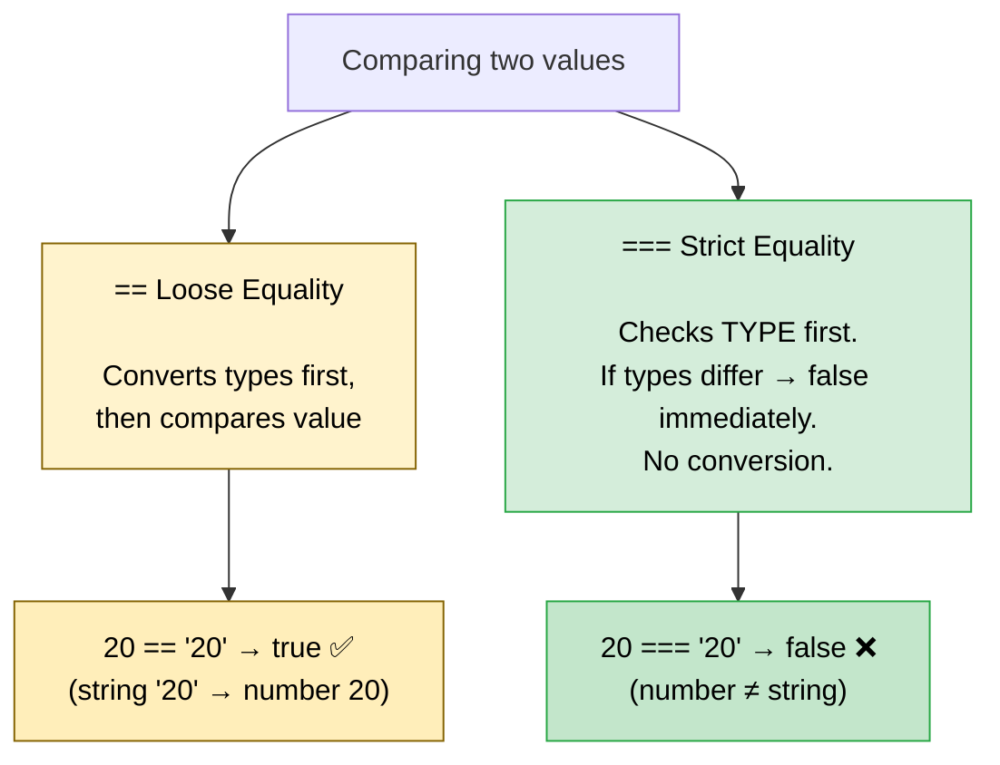
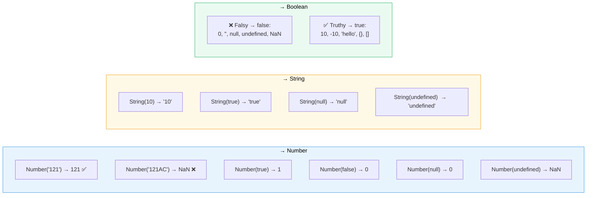
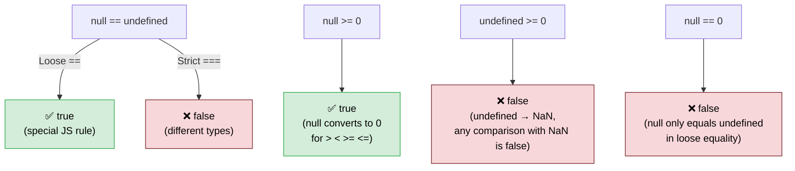
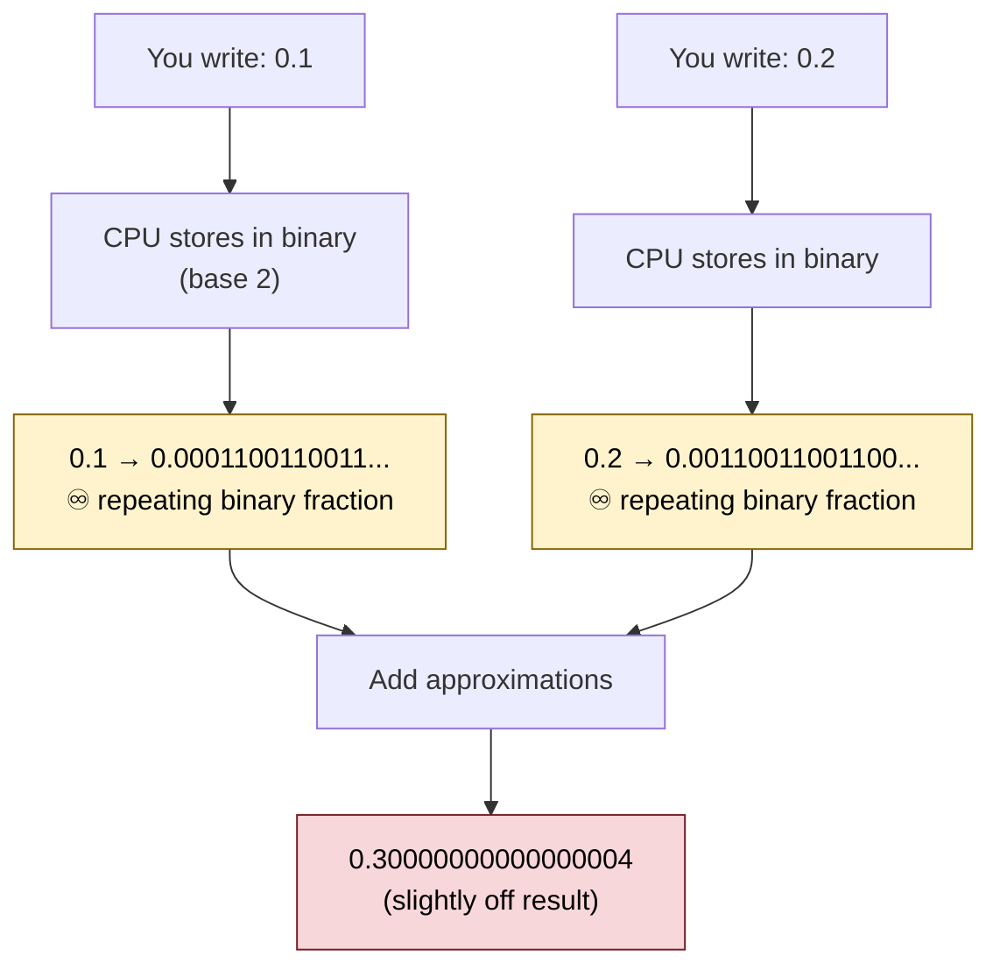
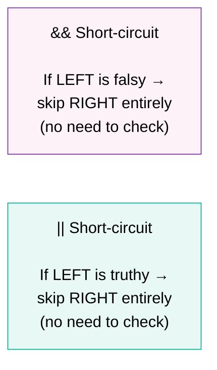
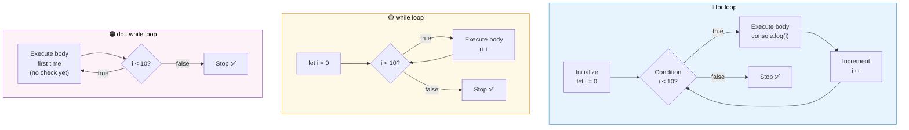
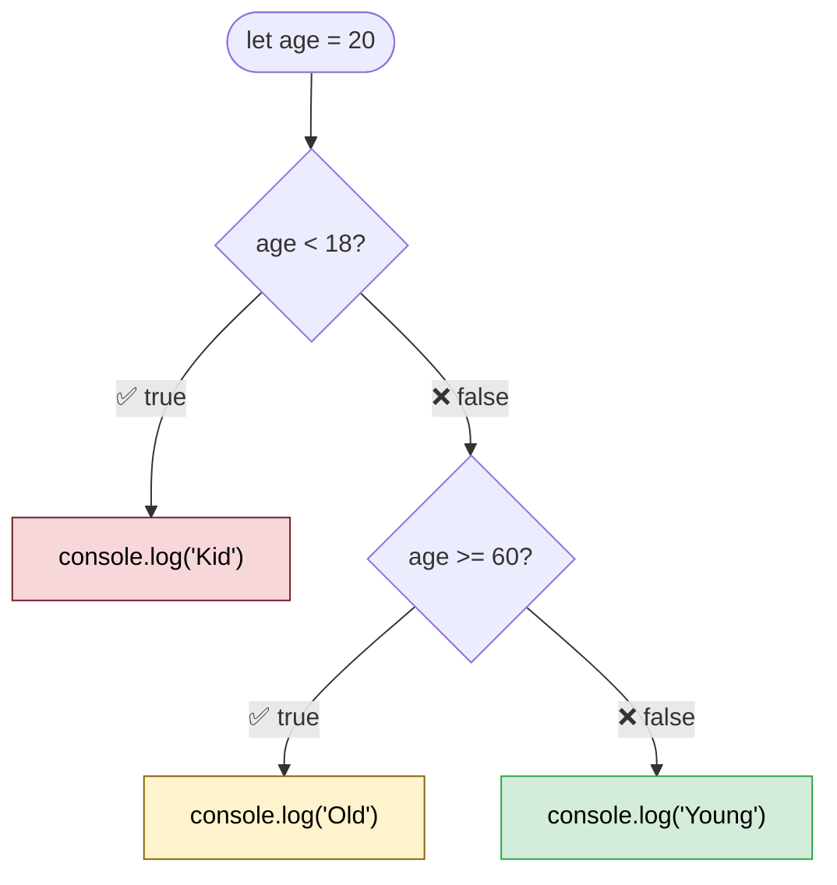
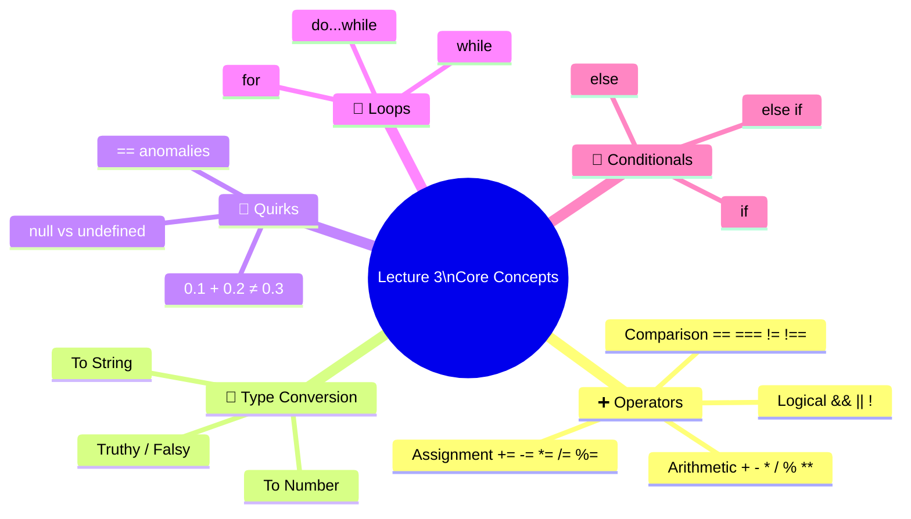

# 🔧 JavaScript — Operators, Loops & Conditionals

> *Lecture 3 · The building blocks of logic — how JavaScript thinks, compares, and repeats.*

---

## 📋 Table of Contents

- [Arithmetic Operators](#-arithmetic-operators)
- [Assignment Operators](#-assignment-operators)
- [Comparison Operators](#-comparison-operators--vs-)
- [Type Conversion & Coercion](#-type-conversion--coercion)
- [Logical Operators](#-logical-operators)
- [The 0.1 + 0.2 Problem](#-the-floating-point-precision-problem)
- [Loops](#-loops)
- [Conditionals](#-conditionals)

---

## ➕ Arithmetic Operators

| Operator | Name | Example | Result |
|:--------:|------|---------|:------:|
| `+` | Addition | `5 + 3` | `8` |
| `-` | Subtraction | `5 - 3` | `2` |
| `*` | Multiplication | `5 * 3` | `15` |
| `/` | Division | `10 / 2` | `5` |
| `%` | Modulus (remainder) | `5 % 2` | `1` |
| `**` | Exponentiation (power) | `5 ** 3` | `125` |

```javascript
5 % 2    // 1   — remainder after dividing 5 by 2
5 ** 2   // 25  — 5 squared (5²)
5 ** 3   // 125 — 5 cubed  (5³)
```

---

## 🟰 Assignment Operators

Instead of writing `x = x + y`, JavaScript lets you shorthand it:

```javascript
let x = 20, y = 10;

x += y;   // x = 30   (x = x + y)
x -= y;   // x = 10   (x = x - y)
x *= y;   // x = 200  (x = x * y)
x /= y;   // x = 2    (x = x / y)
x %= y;   // x = 0    (x = x % y)
```

---

## ⚖️ Comparison Operators — `==` vs `===`

All comparison operators return `true` or `false`.



```javascript
// Loose ==  (type coercion happens)
20 == "20"    // true   — string is converted to number first
0  == false   // true   — false converts to 0

// Strict === (no coercion)
20 === "20"   // false  — number vs string, different types
0  === false  // false  — number vs boolean, different types
```

> 🛡️ **Rule of thumb:** Always prefer `===` and `!==`. They are predictable and safe.

### Full Comparison Operator List

| Operator | Name | Example | Result |
|:--------:|------|---------|:------:|
| `>` | Greater than | `10 > 5` | `true` |
| `<` | Less than | `3 < 2` | `false` |
| `>=` | Greater than or equal | `5 >= 5` | `true` |
| `<=` | Less than or equal | `4 <= 3` | `false` |
| `==` | Loose equal | `"5" == 5` | `true` |
| `===` | Strict equal | `"5" === 5` | `false` |
| `!=` | Loose not equal | `4 != "4"` | `false` |
| `!==` | Strict not equal | `4 !== "4"` | `true` |

---

## 🔄 Type Conversion & Coercion

JavaScript can convert between types — automatically (coercion) or manually.



### 🔢 To Number

```javascript
Number("121")      // 121  ✅
Number("121AC")    // NaN  ❌ (Not a Number)
Number(true)       // 1
Number(false)      // 0
Number(null)       // 0
Number(undefined)  // NaN
```

> ⚠️ `NaN` means **Not a Number** — but `typeof NaN` is still `"number"`. Also, `0 / 0` gives `NaN`.

### 🔤 To String

```javascript
String(10)         // "10"
String(true)       // "true"
String(null)       // "null"
String(undefined)  // "undefined"
```

### ✅ Truthy & Falsy

```javascript
// Falsy values (become false)
Boolean(0)          // false
Boolean("")         // false
Boolean(null)       // false
Boolean(undefined)  // false
Boolean(NaN)        // false

// Truthy values (become true)
Boolean(10)         // true
Boolean(-10)        // true
Boolean("hello")    // true
```

---

### 🕳️ The `null` and `undefined` Anomalies



```javascript
null == undefined   // true  — only these two are loosely equal to each other
null === undefined  // false — different types

null == 0           // false — null only equals undefined (loosely)
null >= 0           // true  — null converts to 0 for relational operators
undefined >= 0      // false — undefined converts to NaN; NaN comparisons = false
```

### 🔡 String Comparison (ASCII)

Strings are compared **character by character** using ASCII values.

```
A=65  B=66 ... Z=90
a=97  b=98 ... z=122
```

```javascript
"Rohit" > "Mohit"   // true  — 'R'(82) > 'M'(77)
"Rohit" > "mohit"   // false — 'R'(82) < 'm'(109)
```

---

## 💥 The Floating Point Precision Problem

### 0.1 + 0.2 ≠ 0.3 ... or does it? 🤔

```javascript
console.log(0.1 + 0.2);          // 0.30000000000000004 😱
console.log(0.1 + 0.2 == 0.3);   // false!
```

### Why does this happen?



> 💡 Just like `1/3` in decimal is `0.333...` (never-ending), `0.1` in binary is a never-ending fraction. The CPU stores only an approximation — adding two approximations gives a slightly wrong result.

### ✅ Solution

Treat numbers as strings and add digit-by-digit (like a human). Many libraries handle this to avoid floating-point errors.

---

## 🔗 Logical Operators

### AND `&&` — Returns first **falsy**, or last value if all truthy

```javascript
true && false      // false   — found falsy, returns it
true && "Rohit"    // "Rohit" — both truthy, returns last
0 && 20            // 0       — 0 is falsy, returns immediately
```

### OR `||` — Returns first **truthy**, or last value if all falsy

```javascript
true || false      // true    — found truthy, returns it
0 || 20            // 20      — 0 is falsy, skips; 20 is truthy
"" || null         // null    — both falsy, returns last
```

### NOT `!` — Flips the boolean

```javascript
!true    // false
!false   // true
!0       // true  (0 is falsy)
!"hi"    // false ("hi" is truthy)
```

### ⚡ Short-Circuiting



```javascript
false && expensiveFunction()   // expensiveFunction never runs ✅
true  || expensiveFunction()   // expensiveFunction never runs ✅
```

---

## 🔁 Loops



### 🔵 For Loop
Best when you know **how many times** to loop.

```javascript
for (let i = 0; i < 10; i++) {
    console.log(i);   // prints 0 through 9
}
```

| Part | Code | Runs |
|------|------|:----:|
| Initialize | `let i = 0` | Once, at start |
| Condition | `i < 10` | Before every iteration |
| Body | `console.log(i)` | Each iteration |
| Increment | `i++` | After each iteration |

> 💡 `i++` is post-increment (add 1 after). `i--` is post-decrement (subtract 1 after).

---

### 🟡 While Loop
Best when you **don't know** how many iterations you'll need.

```javascript
let i = 0;
while (i < 10) {
    console.log(i);
    i++;
}
```

---

### 🟠 Do...While Loop
Guarantees the body runs **at least once** — condition checked after.

```javascript
let i = 0;
do {
    console.log(i);
    i++;
} while (i < 10);
```

---

## 🌿 Conditionals



```javascript
let age = 20;

if (age < 18) {
    console.log("Kid");
} else if (age >= 60) {
    console.log("Old");
} else {
    console.log("Young");   // ✅ this runs
}
```

> 📌 You can chain as many `else if` blocks as you need.
> The **first matching condition** runs — all others are skipped entirely.

---

## 📊 Quick Reference Summary



| Topic | Key Rule |
|-------|----------|
| `==` vs `===` | Always prefer `===` — no surprises |
| Truthy/Falsy | Falsy: `0`, `""`, `null`, `undefined`, `NaN` |
| `&&` | Returns first **falsy** or last value |
| `\|\|` | Returns first **truthy** or last value |
| `for` | Use when iterations are known |
| `while` | Use when iterations are unknown |
| `do...while` | Runs at least **once** regardless of condition |
| `0.1 + 0.2` | Binary floating-point — never compare decimals with `==` |

---

<div align="center">

**Happy Coding! 🚀**

*Made with ❤️ for JavaScript beginners everywhere*

</div>