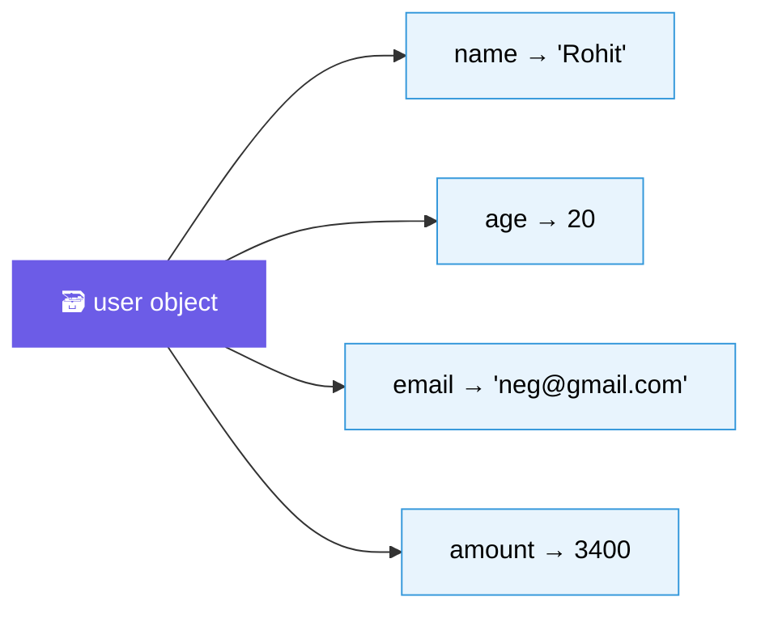
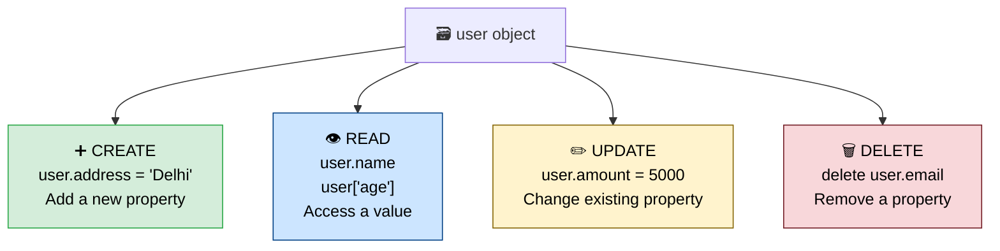
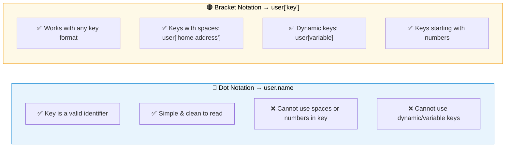
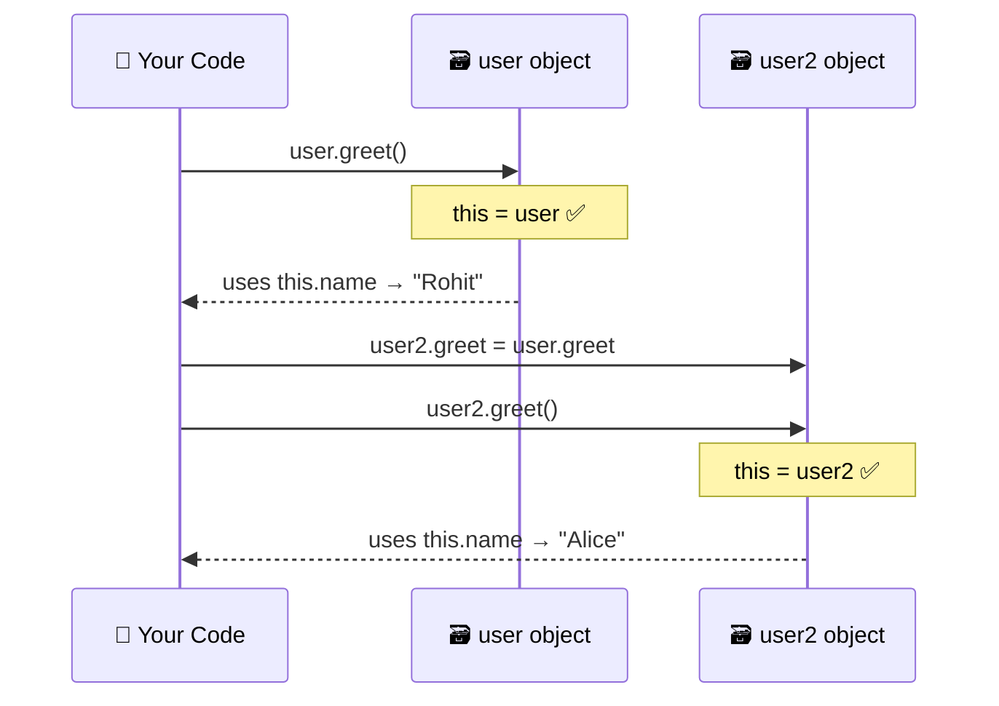
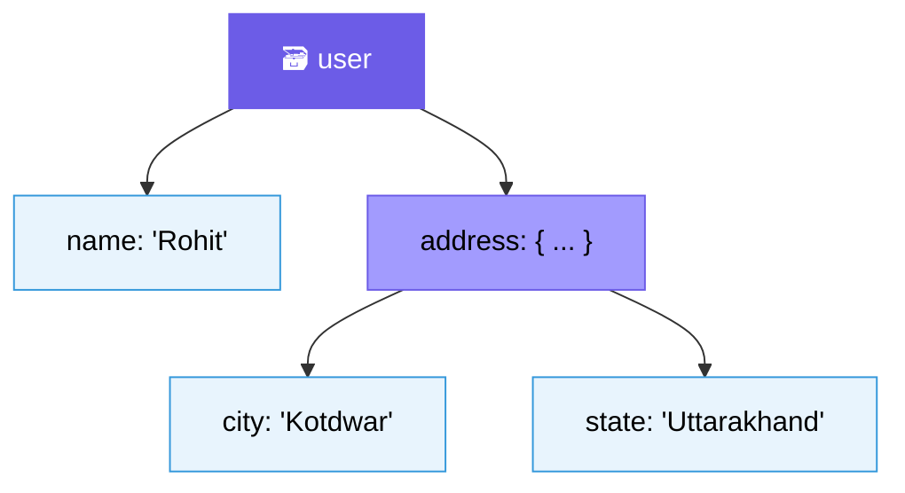
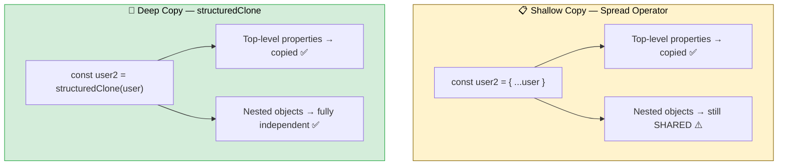
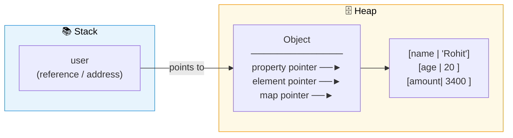
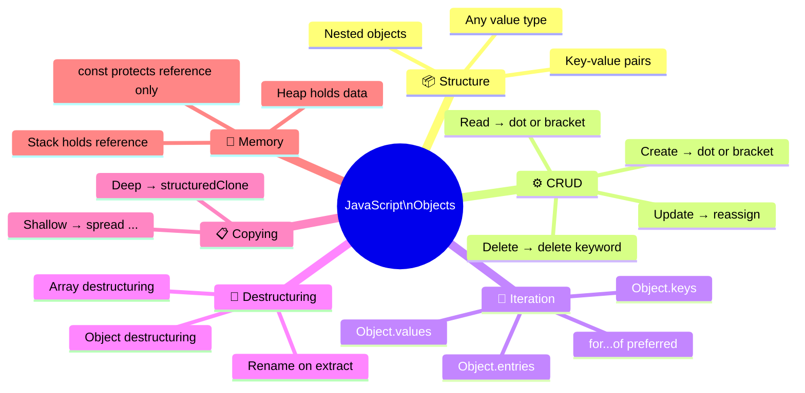

# 🗃️ JavaScript — Objects

> *Lecture 5 · The foundation of JavaScript — containers, references, memory, and everything in between.*

---

## 📋 Table of Contents

- [What is an Object?](#-what-is-an-object)
- [CRUD Operations](#-crud-operations)
- [Dot vs Bracket Notation](#-dot-vs-bracket-notation)
- [Methods & `this`](#️-methods--this)
- [Nested Objects](#-nested-objects)
- [Object Utility Methods](#-object-utility-methods)
- [Looping Over Objects](#-looping-over-objects)
- [Destructuring](#-destructuring)
- [Copying Objects](#-copying-objects)
- [Symbols as Keys](#-symbols-as-keys)
- [Memory — How Objects are Stored](#-memory--how-objects-are-stored)
- [Summary](#-summary)

---

## 📦 What is an Object?

An object is a **container for key–value pairs** — the most fundamental data structure in JavaScript.



```javascript
const user = {
  name:   "Rohit",
  age:    20,
  email:  "neg@gmail.com",
  amount: 3400
};
```

> 🔑 **Keys** are strings (or Symbols). **Values** can be any data type — numbers, strings, arrays, functions, even other objects.

---

## ⚙️ CRUD Operations

Everything you need to do with an object — **Create, Read, Update, Delete**:



```javascript
const user = { name: "Rohit", age: 20, email: "neg@gmail.com", amount: 3400 };

// ➕ Create
user.address = "Delhi";

// 👁️ Read
console.log(user.name);      // "Rohit"
console.log(user["age"]);    // 20

// ✏️ Update
user.amount = 5000;

// 🗑️ Delete
delete user.email;
```

---

## 🔵 Dot vs Bracket Notation



```javascript
// Dot notation — clean, everyday use
user.name

// Bracket notation — needed for special keys
user["home address"] = "Dwarka";    // key with space ✅
console.log(user["home address"]);

// Dynamic key from a variable
let key = "name";
console.log(user[key]);             // "Rohit" ✅
```

---

## ⚙️ Methods & `this`

Objects can hold **functions** — these are called **methods**.

```javascript
const user = {
  name: "Rohit",
  greet() {
    console.log("Strike is coming on 18th October, " + this.name);
  }
};

user.greet();   // "Strike is coming on 18th October, Rohit"
```

### How `this` Works



> 💡 `this` always refers to the **object that calls the method** — not where the function was defined. That's why we write `this.name` instead of hard-coding `user.name`.

---

## 🪆 Nested Objects

Objects can contain other objects — chain dot notation to access deep values.

```javascript
const user = {
  name: "Rohit",
  address: {
    city:  "Kotdwar",
    state: "Uttarakhand"
  }
};

console.log(user.address.city);    // "Kotdwar"
console.log(user.address.state);   // "Uttarakhand"
```



---

## 🔧 Object Utility Methods

Three built-in tools to inspect any object:

```javascript
const user = { name: "Rohit", age: 20, amount: 3400 };

Object.keys(user);     // ["name", "age", "amount"]
Object.values(user);   // ["Rohit", 20, 3400]
Object.entries(user);  // [["name","Rohit"], ["age",20], ["amount",3400]]
```

| Method | Returns | Use case |
|--------|---------|----------|
| `Object.keys(obj)` | Array of keys | Iterate over property names |
| `Object.values(obj)` | Array of values | Work with values only |
| `Object.entries(obj)` | Array of `[key, value]` pairs | Both key and value together |

---

## 🔁 Looping Over Objects

```javascript
// ✅ Preferred — for...of with Object.keys
for (let key of Object.keys(user)) {
  console.log(key, user[key]);
}

// ✅ Cleanest — destructuring with Object.entries
for (let [key, value] of Object.entries(user)) {
  console.log(key, value);
}

// ⚠️ Avoid — for...in includes inherited properties
for (let key in user) {
  console.log(key);
}
```

> 🛑 Prefer `for...of` with `Object.keys/values/entries` over `for...in` — `for...in` can pick up inherited prototype properties unexpectedly.

---

## 🧩 Destructuring

Pull properties out of an object into standalone variables — cleanly.

### Object Destructuring

```javascript
const user = { name: "Rohit", age: 20 };

// Basic
const { name, age } = user;
console.log(name);   // "Rohit"
console.log(age);    // 20

// Rename on the fly
const { name: userName, age: userAge } = user;
console.log(userName);   // "Rohit"
console.log(userAge);    // 20
```

### Array Destructuring

```javascript
const arr = [10, 20, 30];

const [first, second] = arr;
console.log(first);    // 10
console.log(second);   // 20
```

---

## 📋 Copying Objects

Not all copies are equal — this is one of the most important distinctions in JavaScript.



```javascript
const user = { name: "Rohit", address: { city: "Delhi" } };

// 📋 Shallow Copy — spread
const user2 = { ...user };
user2.name = "Alice";          // ✅ independent
user2.address.city = "Mumbai"; // ⚠️ ALSO changes user.address.city!

// 🧬 Deep Copy — structuredClone
const user3 = structuredClone(user);
user3.address.city = "Chennai"; // ✅ user.address.city unchanged
```

**Memory view:**

```
Shallow:
  user  ──► { name: "Rohit", address ──┐ }
  user2 ──► { name: "Alice", address ──┘ }  ← shared reference ⚠️

Deep:
  user  ──► { name: "Rohit", address1: { city: "Delhi"   } }
  user3 ──► { name: "Rohit", address2: { city: "Chennai" } }  ← separate ✅
```

---

## 🔑 Symbols as Keys

Symbols create **guaranteed unique** keys — useful in library/framework code.

```javascript
const sym = Symbol("id");

const user = {
  [sym]: 101,       // must use bracket notation
  name: "Rohit"
};

console.log(user[sym]);   // 101
console.log(user.sym);    // undefined — dot notation doesn't work for Symbols!
```

> 🛡️ Symbol keys are **not included** in `Object.keys()`, `Object.values()`, or `for...in` loops — they're truly private.

---

## 🧠 Memory — How Objects are Stored

Objects live in the **heap** (dynamic memory). Variables hold a **reference** (address) to them in the stack.



### Why you can `.push()` on a `const` array

```javascript
const arr = [10, 20, 30];
arr.push(40);   // ✅ works!
arr = [];       // ❌ Error — can't reassign the reference
```

> The `const` protects the **reference** (stack address), not the **contents** (heap data). Pushing to an array only updates the heap — the reference in the stack never changes.

### Arrays are just Objects!

```
Array internally:  { "0": 10, "1": 20, "2": 30, length: 3 }
                    ↑ numeric string keys under the hood
```

When a value changes, only the **pointer** in the property table is updated. The old value is left for **garbage collection**.

---

## 📊 Summary



| Concept | Best Practice |
|---------|--------------|
| Declaration | Always use `const` for objects & arrays |
| Notation | Dot for simple keys · Bracket for dynamic/special keys |
| Looping | `for...of` + `Object.entries()` over `for...in` |
| Shallow copy | `{ ...obj }` — fast, top-level only |
| Deep copy | `structuredClone(obj)` — fully independent |
| `this` | Refers to the object **calling** the method |
| Symbol keys | Invisible to `Object.keys` — truly private |

---

<div align="center">

**Happy Coding! 🚀**

*Made with ❤️ for JavaScript beginners everywhere*

</div>