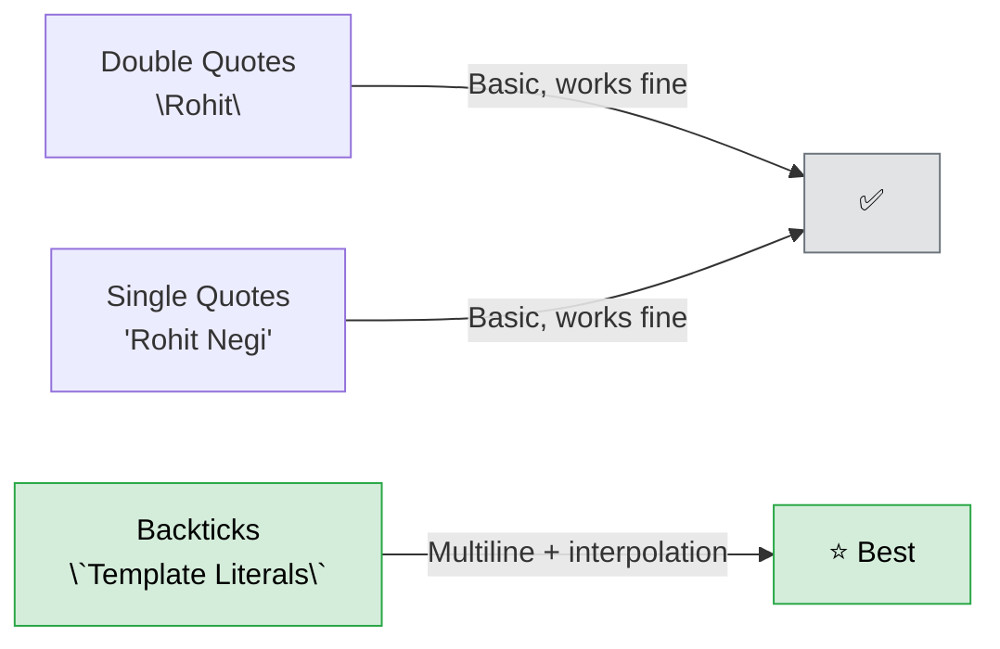
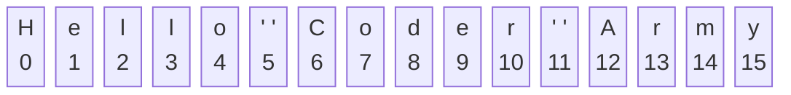
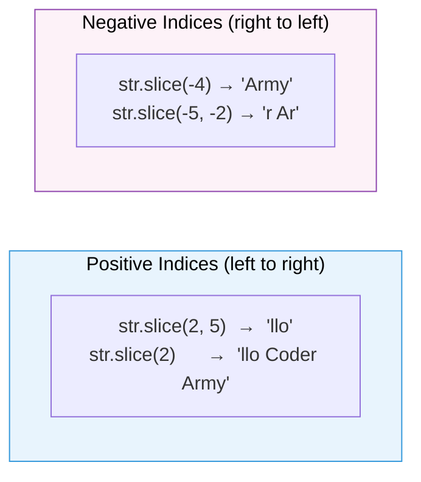
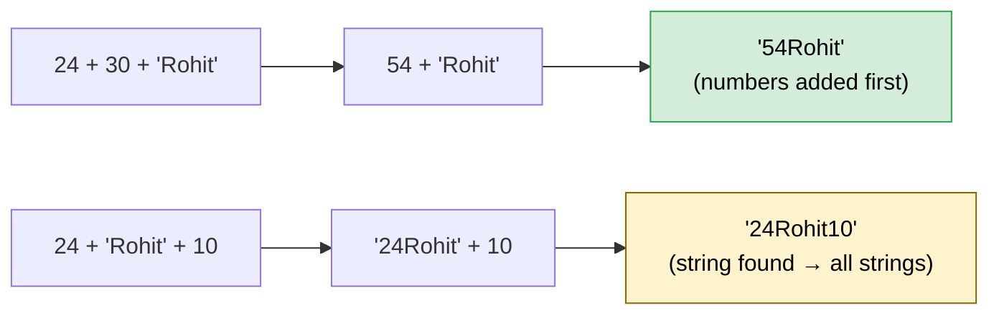
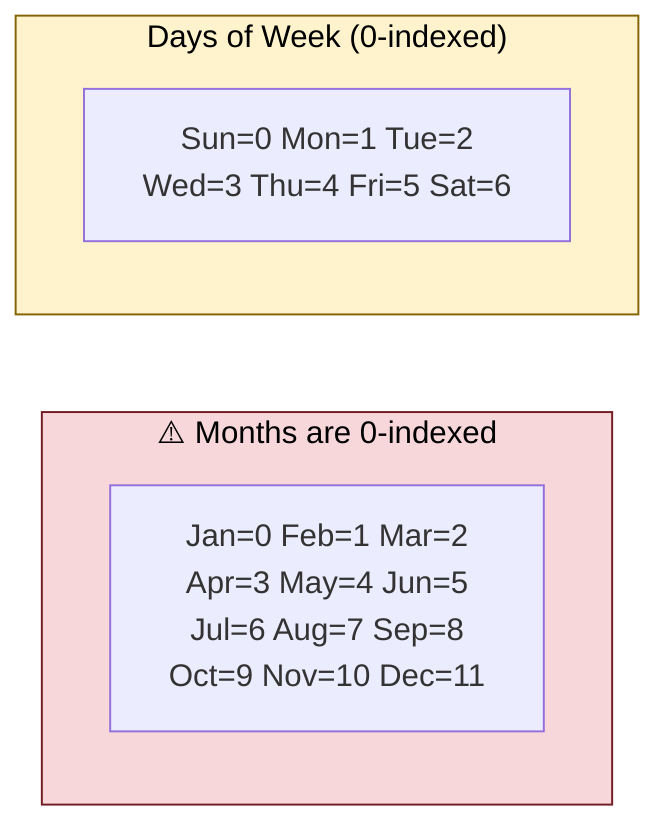
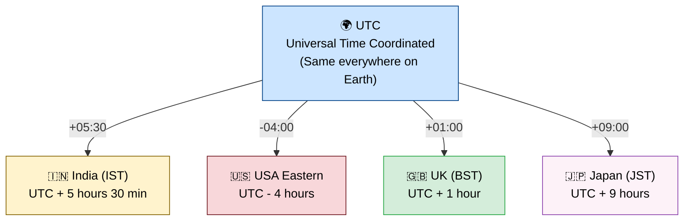
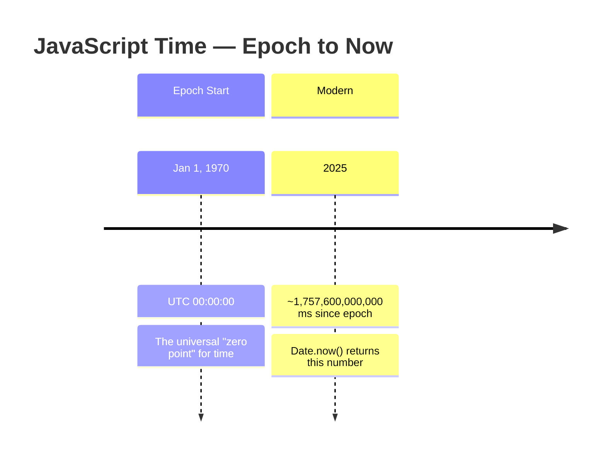

# 🧵 JavaScript — Strings & the Date Object

> *Lecture 4 · Mastering text manipulation and working with time in JavaScript.*

---

## 📋 Table of Contents

- [Creating Strings](#-creating-strings)
- [Length & Indexing](#-length--indexing)
- [String Immutability](#-strings-are-immutable)
- [String Methods](#-string-methods)
- [Concatenation](#-concatenation)
- [The Date Object](#-the-date-object)
- [UTC vs Local Time](#️-utc-vs-local-time)
- [Epoch Time](#-epoch-time--datenow)
- [Quick Reference](#-quick-reference)

---

## ✏️ Creating Strings

Three ways to create a string — but backticks are the modern winner.



### Why Backticks Win

**1. Multi-line strings** — no errors when breaking lines:

```javascript
// ❌ Double/single quotes break on newline
let bad = "Line one
Line two";   // SyntaxError!

// ✅ Backticks handle it perfectly
let good = `Line one
Line two`;   // Works!
```

**2. Variable interpolation** with `${...}`:

```javascript
let day = 18;
console.log(`Strike is coming on ${day}`);
// Output: Strike is coming on 18
```

---

## 📏 Length & Indexing



```javascript
let str = "Hello Coder Army";

str.length   // 16  (spaces count as characters!)
str[0]       // 'H'
str[6]       // 'C'
str[15]      // 'y'
```

> 💡 Indices start at **0**. Spaces are counted as characters.

---

## 🧊 Strings are Immutable

Once created, a string's characters **cannot be changed directly**.

```javascript
let str = "Hello Coder Army";

str[2] = 'L';       // ❌ does nothing — no error, no change
console.log(str);   // "Hello Coder Army"  — still the same
```

> 🔑 Every string method **returns a new string**. The original is never modified.

---

## 🛠️ String Methods

### 🔠 Case Conversion

```javascript
let str = "Hello Coder Army";

str.toUpperCase()   // "HELLO CODER ARMY"
str.toLowerCase()   // "hello coder army"
// Original str is unchanged ✅
```

---

### 🔍 Searching

```javascript
let str = "Hello Coder Army";

str.indexOf("Coder")      // 6   — first occurrence (or -1 if not found)
str.indexOf("cer")        // -1  — case-sensitive, not found

let s = "Coder and Coder";
s.lastIndexOf("Coder")    // 10  — last occurrence

str.includes("Army")      // true
str.includes("xyz")       // false
```

| Method | Returns | Notes |
|--------|:-------:|-------|
| `indexOf(sub)` | Index or `-1` | First occurrence, case-sensitive |
| `lastIndexOf(sub)` | Index or `-1` | Last occurrence |
| `includes(sub)` | `true`/`false` | Clean boolean check |

---

### ✂️ Slicing — `slice(start, end)`

Extracts characters from `start` up to (**not including**) `end`.



```javascript
let str = "Hello Coder Army";
//  Positive:  0  1  2  3  4  5  6  7  8  9  10 11 12 13 14 15
//  Negative: -16-15-14-13-12-11-10 -9 -8 -7 -6 -5 -4 -3 -2 -1

str.slice(2, 5)     // "llo"           — index 2 to 4
str.slice(2)        // "llo Coder Army"— index 2 to end
str.slice(-4)       // "Army"          — last 4 characters
str.slice(-5, -2)   // "r Ar"          — from -5 up to -3
```

> 🆚 `substring(start, end)` works like `slice` but **no negative indices** — negatives are treated as `0`.

---

### 🔁 Replace

```javascript
"Hello Coder".replace("Coder", "Army")    // "Hello Army"  — first match only
"a a a".replaceAll("a", "b")              // "b b b"       — all matches
```

---

### ✂️ Trim Whitespace

```javascript
"   Hello   ".trim()        // "Hello"   — both ends
"   Hello   ".trimStart()   // "Hello   "— leading only
"   Hello   ".trimEnd()     // "   Hello"— trailing only
```

> ℹ️ Only **edge** spaces are removed. Spaces between words stay.

---

### 🪓 Split into Array

```javascript
"Rohit,Mohit,Suraj".split(",")   // ["Rohit", "Mohit", "Suraj"]
"a b c".split(" ")               // ["a", "b", "c"]
```

---

## ➕ Concatenation

Joining strings with `+` has a **left-to-right** evaluation quirk:



```javascript
24 + 30 + "Rohit"   // "54Rohit"   — numbers added first, then string concat
24 + "Rohit" + 10   // "24Rohit10" — string met first, rest become strings
```

---

## 📅 The Date Object

### Getting the Current Time

```javascript
let now = new Date();

now.toString()       // "Wed Oct 01 2025 04:08:49 GMT+0530 (IST)"
now.toISOString()    // "2025-09-30T22:36:34.125Z"  — UTC format
now.toLocaleString() // local date and time (country-specific format)
```

> ⚙️ Time is taken from your **system clock** — even offline, a hardware clock keeps ticking.

---

### 📅 Extracting Components

```javascript
let now = new Date();

now.getFullYear()   // 2025
now.getMonth()      // 9    ← ⚠️ 0-based! (Jan=0, Feb=1, … Oct=9, Dec=11)
now.getDate()       // 1    ← day of month (1-based)
now.getDay()        // 3    ← day of week (0=Sun, 1=Mon … 6=Sat)
now.getHours()      // 4
now.getMinutes()    // 8
now.getSeconds()    // 49
```



> 🐛 **Why the inconsistency?** JavaScript copied Java's old `Date` implementation. It can't be fixed now without breaking millions of existing websites.

---

### 🛠️ Creating Custom Dates

```javascript
// new Date(year, month, day, hours, minutes, seconds, milliseconds)

let custom = new Date(2025, 8, 20, 8, 25, 16, 125);
//                         ↑
//                     month=8 → September (0-based!)
```

---

## 🕰️ UTC vs Local Time



```javascript
// UTC timestamp received from server
let d = new Date('2025-09-30T22:36:34Z');   // Z = UTC

d.toString();   // Browser auto-converts → shows YOUR local time ✅
```

> 💡 **Why UTC matters for apps:** When storing contest submissions, video upload times, or any timestamp — store in **UTC milliseconds**. The browser then auto-converts to each user's local time correctly.

---

## ⏱️ Epoch Time & `Date.now()`



```javascript
Date.now()         // e.g., 1757600000000  — milliseconds since Jan 1, 1970 UTC

new Date(0)        // "Thu Jan 01 1970 05:30:00 GMT+0530"  (epoch start, in IST)
new Date(Date.now()) // today's date
```

> 🗄️ Timestamps are just **plain numbers** — easy to store in databases, compare, sort, and transmit across timezones.

---

## 📊 Quick Reference

### String Methods Cheatsheet

| Method | What it does | Returns |
|--------|-------------|:-------:|
| `str.length` | Character count | Number |
| `str.toUpperCase()` | ALL CAPS | String |
| `str.toLowerCase()` | all lowercase | String |
| `str.indexOf(s)` | First index of `s` | Number / `-1` |
| `str.lastIndexOf(s)` | Last index of `s` | Number / `-1` |
| `str.includes(s)` | Does `s` exist? | Boolean |
| `str.slice(s, e)` | Extract `s` to `e` | String |
| `str.substring(s, e)` | Like slice, no negatives | String |
| `str.replace(a, b)` | Replace first `a` with `b` | String |
| `str.replaceAll(a, b)` | Replace all `a` with `b` | String |
| `str.trim()` | Remove edge spaces | String |
| `str.trimStart()` | Remove leading spaces | String |
| `str.trimEnd()` | Remove trailing spaces | String |
| `str.split(sep)` | Split into array | Array |

### Date Methods Cheatsheet

| Method | Example Output |
|--------|---------------|
| `new Date()` | Current date & time |
| `Date.now()` | `1757600000000` (ms since epoch) |
| `date.toString()` | `"Wed Oct 01 2025 04:08:49 GMT+0530"` |
| `date.toISOString()` | `"2025-09-30T22:36:34.125Z"` |
| `date.toLocaleString()` | Local formatted string |
| `date.getFullYear()` | `2025` |
| `date.getMonth()` | `9` *(0-based — add 1 for human month!)* |
| `date.getDate()` | `1` *(day of month)* |
| `date.getDay()` | `3` *(0=Sun … 6=Sat)* |
| `date.getHours()` | `4` |
| `date.getMinutes()` | `8` |
| `date.getSeconds()` | `49` |

---

<div align="center">

**Happy Coding! 🚀**

*Made with ❤️ for JavaScript beginners everywhere*

</div>