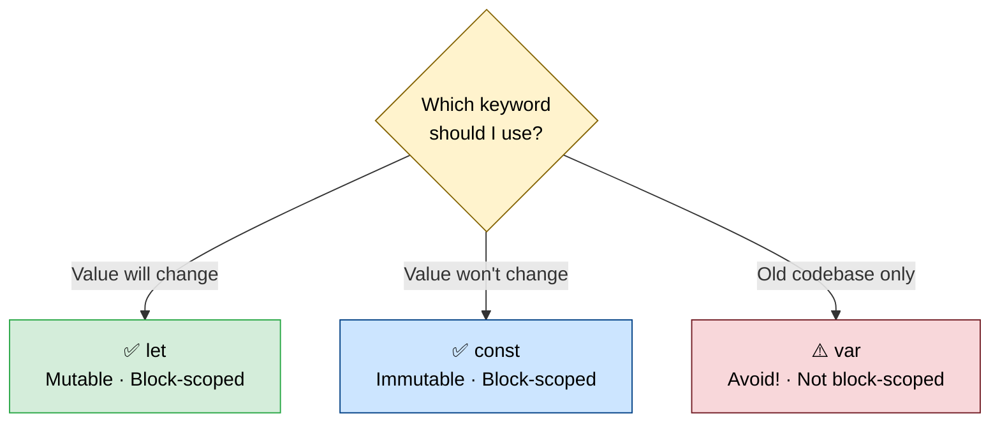
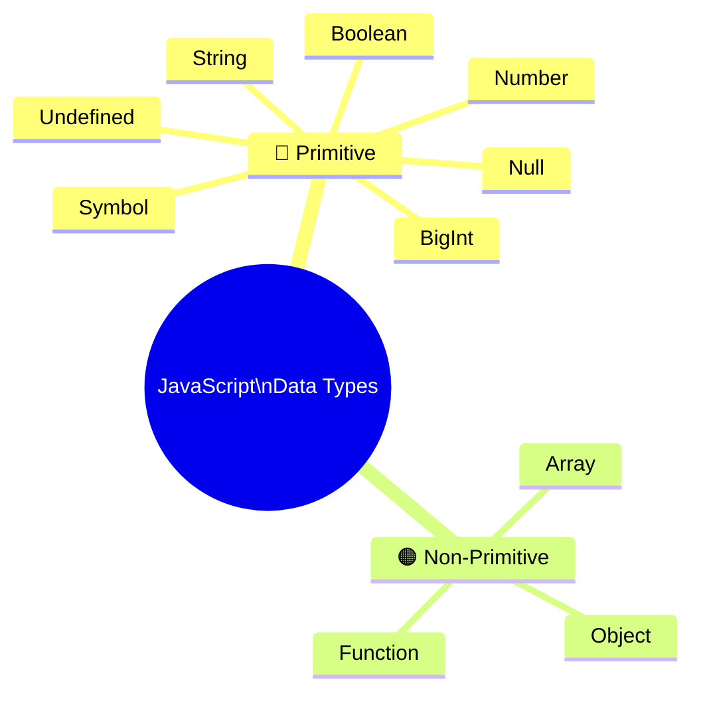
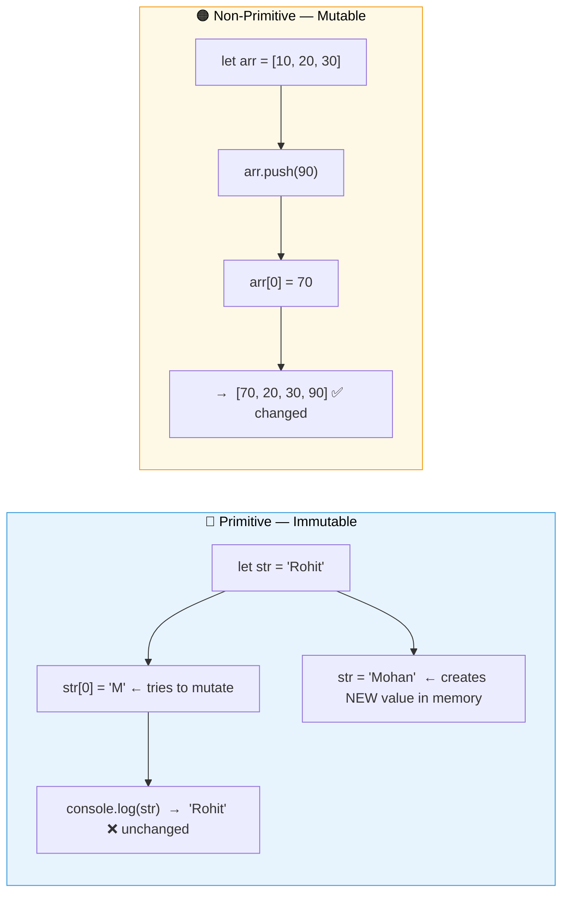
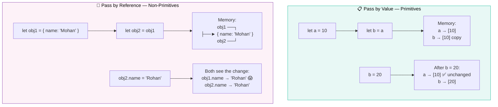
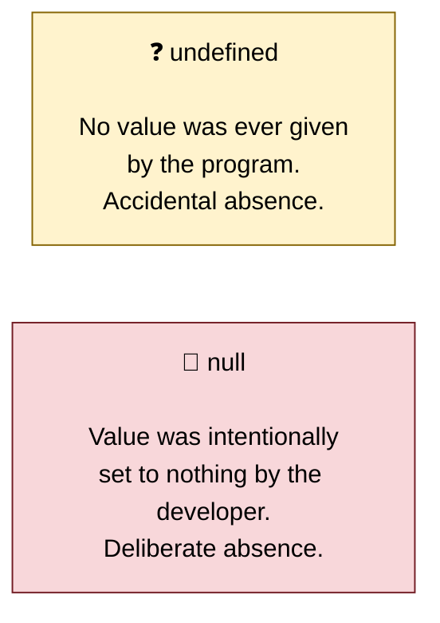
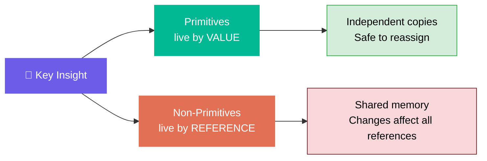

# 📦 JavaScript — Variables, Data Types & Memory

> *Lecture 2 · Created by Brendan Eich in just **10 days** in 1995 — built for simplicity.*

---

## 📋 Table of Contents

- [Variable Declaration](#-variable-declaration)
- [Data Types Overview](#-data-types-overview)
- [Primitive Data Types](#-primitive-data-types-in-detail)
- [Non-Primitive Data Types](#-non-primitive-data-types)
- [Immutability vs Mutability](#-immutability-vs-mutability)
- [Pass by Value vs Pass by Reference](#-pass-by-value-vs-pass-by-reference)
- [Summary Table](#-quick-summary)

---

## 📝 Variable Declaration

JavaScript gives you three ways to declare variables. Choose wisely.



### ✅ `let` — Mutable Variable

```javascript
let name = "Rohit";
name = "Alice";        // ✅ allowed — value can change
console.log(name);     // Alice
```

- Value **can** be changed after assignment
- **Block-scoped** — lives only inside the `{ }` it was declared in

---

### ✅ `const` — Constant Variable

```javascript
const account = 1234;
account = 23;          // ❌ Error! Cannot reassign a const
```

- Value **cannot** be changed after assignment
- Must be assigned a value **at declaration**
- Also **block-scoped**

---

### ⚠️ `var` — The Old Way *(Avoid!)*

```javascript
var a = 10;
var a = 30;    // ❌ No error — silently allows redeclaration (dangerous!)

if (true) {
    var x = 5;
}
console.log(x); // 5 — leaks outside the block! 😱
```

| Problem | Why it's bad |
|---------|-------------|
| Allows **redeclaration** | Silent bugs — no error when you overwrite a variable accidentally |
| **Not block-scoped** | Variables leak outside `if`, `for`, `while` blocks |

> 🛑 **Rule:** Always use `let` or `const`. Never use `var`.

---

## 🗂️ Data Types Overview



| Category | Types | Stored As | Mutable? |
|:--------:|-------|:---------:|:--------:|
| 🔵 **Primitive** | Number, String, Boolean, Undefined, Null, BigInt, Symbol | Value | ❌ No |
| 🟠 **Non-Primitive** | Object, Array, Function | Reference | ✅ Yes |

---

## 🔵 Primitive Data Types in Detail

### 🔢 Number
Handles both integers and decimals.

```javascript
let price = 99.5;
typeof price;   // "number"
```

> 💡 Stored in **8 bytes (64 bits)**. Max safe integer: `2^53 - 1`

---

### 🔤 String
Text wrapped in quotes.

```javascript
let username = "Rohit";
typeof username;   // "string"
```

---

### ✅ Boolean
Only two possible values.

```javascript
let isLoggedIn = true;
typeof isLoggedIn;   // "boolean"
```

---

### ❓ Undefined
A variable declared but **never assigned** a value.

```javascript
let user;
typeof user;   // "undefined"
```

---

### 🚫 Null
An **intentional** absence of value — the programmer set it on purpose.

```javascript
let temperature = null;   // I purposely set no value
typeof null;   // "object"  ❗ Famous JavaScript bug!
```

> ⚠️ `typeof null` returns `"object"` — this is a **historic bug** in JavaScript that was never fixed to avoid breaking the web.

---

### 🔣 BigInt
For integers **beyond** `2^53 - 1`. Add `n` at the end.

```javascript
let bigNum = 12345678901234567890n;
typeof bigNum;   // "bigint"
```

---

### 🔑 Symbol
Creates a **guaranteed unique** identifier — even if descriptions match.

```javascript
const id1 = Symbol('id');
const id2 = Symbol('id');
console.log(id1 === id2);   // false — always unique!
typeof id1;   // "symbol"
```

---

### 🔍 `typeof` Cheat Sheet

```javascript
typeof 42            // "number"
typeof "hello"       // "string"
typeof true          // "boolean"
typeof undefined     // "undefined"
typeof null          // "object"   ❗ BUG
typeof 10n           // "bigint"
typeof Symbol()      // "symbol"

typeof {}            // "object"
typeof []            // "object"
typeof function(){}  // "function"
```

---

## 🟠 Non-Primitive Data Types

### 📚 Array
An ordered list of values (any type allowed).

```javascript
let arr = [10, 20, "Rohit", true];
typeof arr;   // "object"
```

### 🗃️ Object
Structured data in **key-value** pairs.

```javascript
let user = {
    name: "Rohit",
    age: 18,
    account: 12312
};

user.name;        // "Rohit"
user["name"];     // "Rohit"  (both work)
typeof user;      // "object"
```

### ⚙️ Function
A reusable block of code — storable in a variable.

```javascript
let add = function() {
    return "Hello";
};

let s = add;          // function assigned to another variable
console.log(s());     // "Hello"
typeof add;           // "function"  (actually an object under the hood)
```

---

## 🧊 Immutability vs Mutability



#### Proof — Strings are immutable:
```javascript
let str = "Rohit";
str[0] = 'M';
console.log(str);   // "Rohit"  — the original is untouched
```

When you do `str = "Mohan"`:
- A **new** string `"Mohan"` is created at a new memory address
- `str` now points to `"Mohan"`
- The old `"Rohit"` still exists untouched until garbage collected

#### Arrays and Objects are mutable:
```javascript
let arr = [10, 20, 30];
arr.push(90);
arr[0] = 70;
console.log(arr);   // [70, 20, 30, 90]  ✅
```

---

## 📬 Pass by Value vs Pass by Reference

This is one of the **most important concepts** in JavaScript memory behaviour.



### 📋 Pass by Value (Primitives)

```javascript
let a = 10;
let b = a;   // value is COPIED
b = 20;

console.log(a);   // 10  ✅ — a is not affected
console.log(b);   // 20
```

`b` gets its own **independent copy** — changing `b` never affects `a`.

---

### 🔗 Pass by Reference (Non-Primitives)

```javascript
let obj1 = { name: "Mohan", age: 20 };
let obj2 = obj1;        // reference is COPIED (same address!)

obj2.name = "Rohan";    // modifying through obj2...

console.log(obj1.name); // "Rohan"  — obj1 changed too! 😱
```

Both `obj1` and `obj2` point to the **exact same object in memory**. Changing one changes both.

> 💡 **Why?** Objects and arrays can be huge. Copying all that data on every assignment would be wasteful and slow. So JavaScript shares the reference instead.

---

## ⚡ null vs undefined



```javascript
let user;                  // undefined — nobody assigned a value
let temperature = null;    // null — I chose to set it to nothing
```

---

## 📊 Quick Summary

| Concept | 🔵 Primitive | 🟠 Non-Primitive |
|---------|:------------:|:----------------:|
| **Examples** | Number, String, Boolean, Null, Undefined, BigInt, Symbol | Object, Array, Function |
| **Stored as** | Value | Reference (address) |
| **Mutable?** | ❌ No | ✅ Yes |
| **Assignment** | Copies the value | Copies the reference |
| **`typeof`** | Returns own type *(except `null`)* | `"object"` *(except `function`)* |

---



---

<div align="center">

**Happy Coding! 🚀**

*Made with ❤️ for JavaScript beginners everywhere*

</div>