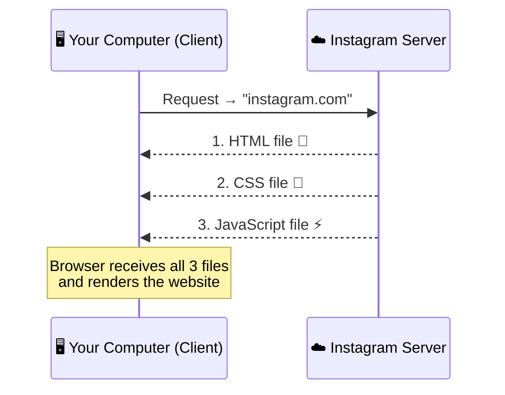
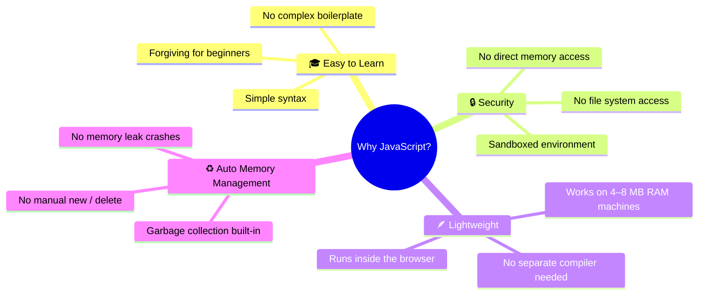
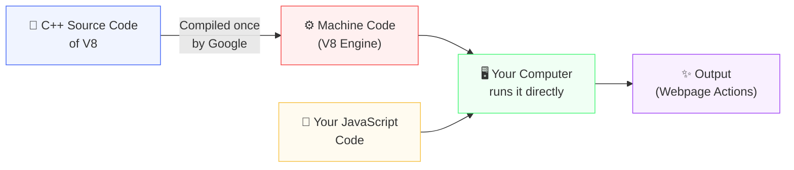
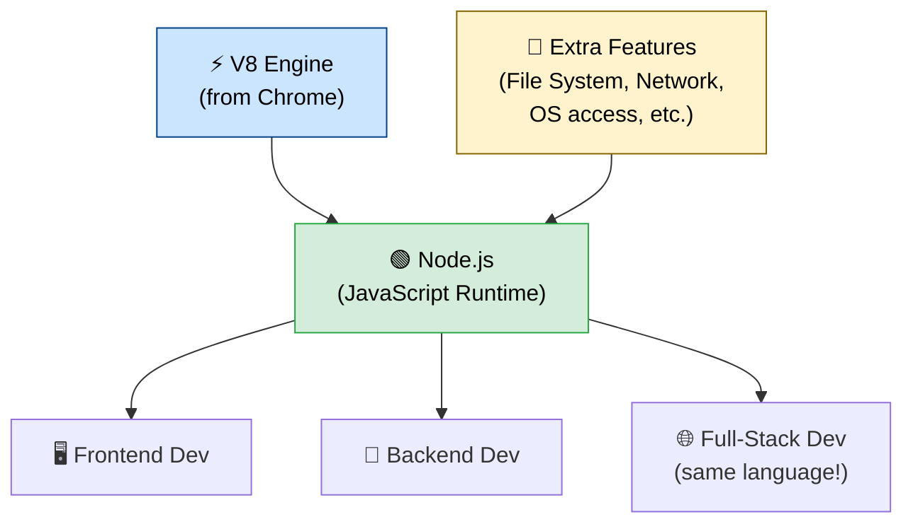
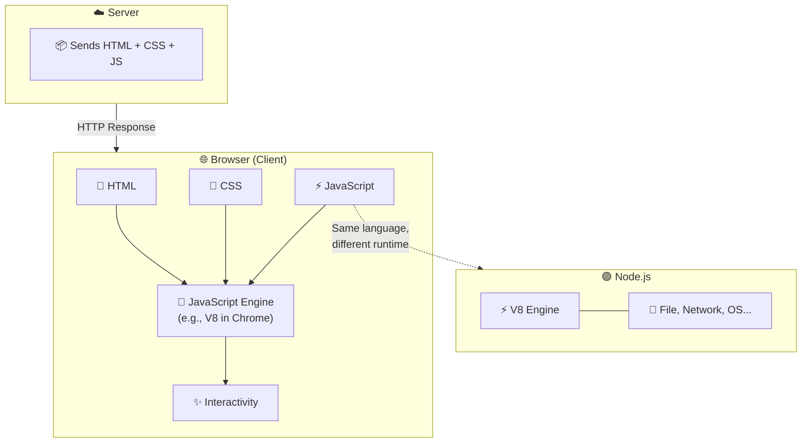

# ⚡ JavaScript — The Complete Beginner's Guide

> *From "what is JavaScript?" to running it on a server — explained simply.*

---

## 📋 Table of Contents

- [What is JavaScript?](#-what-is-javascript)
- [How the Web Works](#-how-the-web-works)
- [Why Was JavaScript Created?](#-why-was-javascript-created)
- [How JavaScript Runs in the Browser](#️-how-javascript-runs-in-the-browser)
- [Running JavaScript Outside the Browser](#-running-javascript-outside-the-browser-nodejs)
- [Summary](#-summary)

---

## 🌐 What is JavaScript?

The web is built on three pillars:

| Technology | Role |
|:----------:|:-----|
| 🏗️ **HTML** | Creates the structure of a website |
| 🎨 **CSS** | Makes it look beautiful (styling, transitions) |
| ⚡ **JavaScript** | Adds **interactivity** and makes it dynamic |

Without JavaScript, a website is like a **painting** — you can see it, but you can't interact with it.

### 💡 Real Example

```
❌ HTML + CSS only → A calculator that looks great but can't add 10 + 20
✅ Add JavaScript  → Click the button → See the answer: 30
```

---

## 🔄 How the Web Works

When you visit a website, here's what happens under the hood:



> 🧠 **Key Insight:** Browsers have a **built-in ability** to understand and run JavaScript. Without this, all the interactive parts would be completely broken.

---

## 🤔 Why Was JavaScript Created?

Around **1995**, only HTML and CSS existed. Languages like C++ and Java were already around — so why build a new language? There were **4 big reasons**:



---

### 🎓 Reason 1 — Easy to Learn

Early web developers were mostly **designers**, not hardcore programmers. C++ was simply too complex for them.

Compare the two side by side:

<table>
<tr>
<th>😰 C++ "Hello World"</th>
<th>😊 JavaScript "Hello World"</th>
</tr>
<tr>
<td>

```cpp
#include <iostream>
using namespace std;

int main() {
    cout << "Hello World";
    return 0;
}
```

</td>
<td>

```javascript
console.log("Hello World")
```

</td>
</tr>
</table>

**JavaScript wins in simplicity.** ✅

---

### 🔒 Reason 2 — Security

C++ gives **low-level memory access** — dangerous in a browser environment.

If websites could run C++ code freely, they could:

- 🗑️ Delete files on your computer
- 🕵️ Steal private data
- 💥 Format your hard disk

JavaScript is **sandboxed**. It can only:
- Manipulate the webpage (HTML/CSS)
- Handle browser events (mouse, keyboard)
- Ask your **explicit permission** before accessing the camera or microphone

---

### 🪶 Reason 3 — Lightweight Design

```
1995 Hardware Reality:
  RAM        →  4–8 MB
  Hard Disk  →  ~200 MB

Running a C++ compiler inside the browser? Way too heavy.
JavaScript was designed to be lightweight — runs inside the browser with no extra compiler needed.
```

---

### ♻️ Reason 4 — Automatic Garbage Collection

| Feature | C++ | JavaScript |
|---------|:---:|:----------:|
| Manual memory allocation | ✅ `new` | ❌ Not needed |
| Manual memory freeing | ✅ `delete` | ❌ Not needed |
| Forgetting = crash | 💥 Yes | 🛡️ Handled automatically |
| Auto garbage collection | ❌ | ✅ |

---

## ⚙️ How JavaScript Runs in the Browser

### The JavaScript Engine

Every browser ships with a JavaScript engine:

| Browser | Engine |
|:-------:|:------:|
| 🟡 Chrome | V8 |
| 🦊 Firefox | SpiderMonkey |
| 🧭 Safari | JavaScriptCore |

### 🔬 What is the V8 Engine?

V8 is a piece of **code written in C++** that takes JavaScript as input and produces output (actions on the webpage).



> 💡 **The Trick:** Google pre-compiles V8's C++ into machine code. Your browser ships with this pre-compiled binary, so you never need a C++ compiler yourself.

V8 works as an **interpreter** — it reads JavaScript **line by line** and executes it immediately.

> 🪟🍎🐧 This is why Chrome has separate downloads for Windows, Mac, and Linux — the machine code is **platform-specific**.

---

## 🚀 Running JavaScript Outside the Browser (Node.js)

### The Problem

Before Node.js, JavaScript was **locked inside the browser**. You couldn't run a `.js` file on your computer like you could with Python or C++.

### The Solution

Someone extracted the **V8 engine from Chrome**, wrapped it with extra capabilities, and created **Node.js**:



### ▶️ Running JavaScript with Node.js

**Step 1:** Download and install Node.js from [nodejs.org](https://nodejs.org)

**Step 2:** Create your file `script.js`

```javascript
console.log("Strike is coming!");
```

**Step 3:** Run it in your terminal

```bash
node script.js
```

```
Output: Strike is coming!
```

---

## 📊 Summary



### 🎯 Key Takeaways

> ⚡ **JavaScript** was born to add interactivity to the web — in a simple, secure, lightweight, and memory-friendly way.

> 🔧 **Browsers** run JavaScript using an engine like V8, which is pre-compiled C++ code that interprets JS line by line.

> 🟢 **Node.js** untied JavaScript from the browser, making it a universal language for both **frontend** and **backend** development.

---

<div align="center">

**Happy Coding! 🚀**

*Made with ❤️ for JavaScript beginners everywhere*

</div>